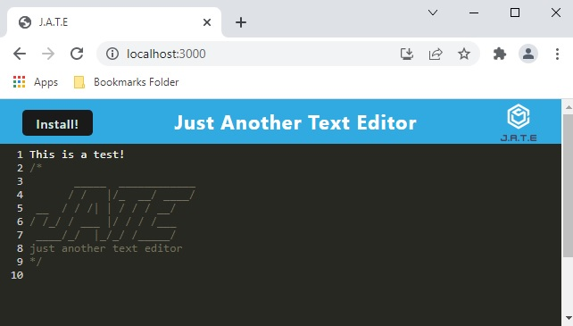

# Text Editor

Text Editor Project for UNH Boot Camp # 19 - PWA. 
This repository was created for the Homework Assignment dealing with PWA (Progressive Web Applications).  

Developer: Duane Cantera 
Date: Feb. 8, 2022 
Assignment: #19 - PWA - Text Editor  

This project consisted of building a text editor that runs in the browser.  This application is a 
single-page application that meets the PWA (Progressive Web Application) criteria.  Additionally,
it will feature a number of data persistence techniques that serve as redundancy in case one of the
options is not supported in the browser.  The application will also function offline  

## Technologies Used:
**Express.js:**  For routing.  
**Babel:**  A toolchain that is used to convert ECMAScript 2015+ code into a backward compatible version
of JavaScript in current and older browsers or environments.  
**Webpack:**  A static module bundler for JavaScript applications.  It packages all the modules in your
application into one or more bundles and serves it to the browser.  
**Workbox-Webpack-Plugin:**  Workbox provides two webpack plugins.  One that generates a complete service
worker for you and one that generates a list of assets to precache that is injected into a service
worker file.  The plugins are implemented as two classes in the workbox-webpack-plugin module, named
GenerateSW and injectManifest.  
**CSS-Loader:**  A front-end component is defined as an npm Module that collects all the css files referenced
in the working application to help webpack consolidate all the css files into a string.  This compiles an application
of a particular resource as a JavaScript module (CSS to JS file).  
**Html-Webpack-Plugin:**  Simplifies creation of HTML files to serve your webpack bundles.  
**HTTP-Server:**  Software that understands URL's (Web Addresses and HTTP).  
**Style-Loader:**  Takes CSS you've imported in your JavaScript files, and injects them as 
tags into the DOM.  
**Nodemon:**  A command-line interface (CLI) utility developed by @rem that wraps your node application
and watches the file system and restarts the process.  

## Text Editor Application Functionality:
 

  

* When the "npm run start" command is entered in the Visual Studio Code terminal the application should
start up the backend and serve the client.
* All JavaScript files should have been bundled using webpack.
* A HTML file, service worker and a manifest files are generated.
* When the user enters content and subsequently clicks off of the DOM window the content is saved
in the IndexedDB database.
* When the text editor is reopened after closing it the content in the text editor is retrieved
from the IndexedDB database.
* The application can be downloaded as an icon on the users desktop by selecting the "Install!" button.
* The application works without an internet connection.
* A Service Worker should be registered and using workbox.
* Static assets are pre cached upon loading along with subsequent pages and static assets.
* The application is deployed and can be run from Heroku.  

## LINKS:

Git Hub Link To Code For Project:  
https://github.com/canterad/Text_Editor.git
  
Link to URL of application deployed on Heroku: 
https://young-escarpment-35231.herokuapp.com/
